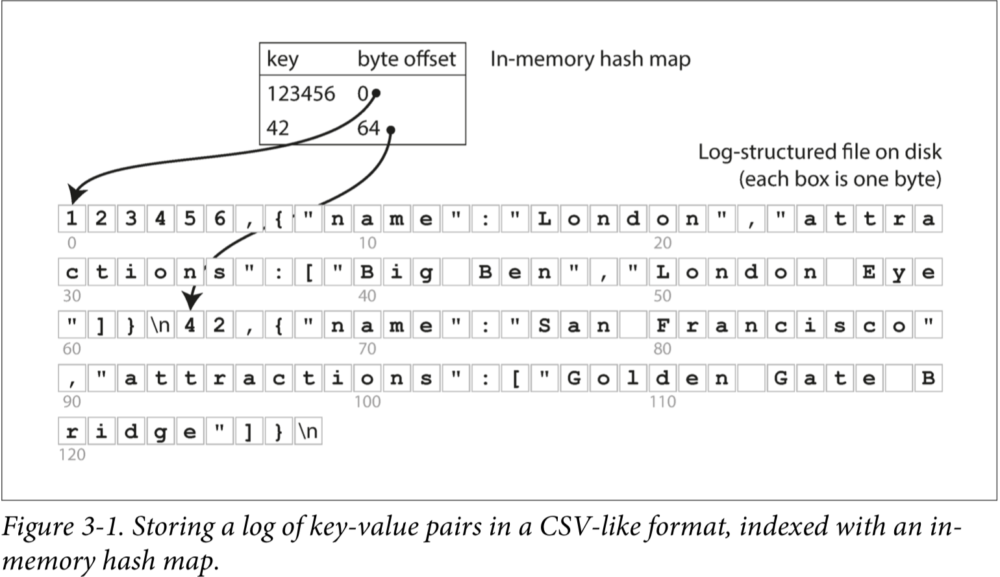
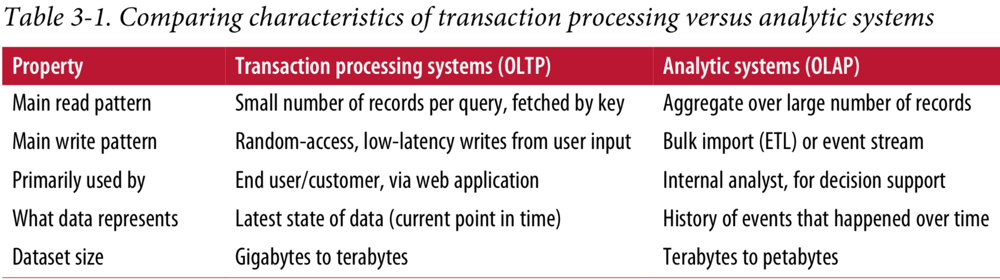

# Data Models
## relational vs document

- **SQL:**
    * relations (tables in SQL)
    * each relation is an unordered collection of tuples (rows in SQL)
    * Rdbms (short for relational database management system)

- **NoSQL (Not Only SQL)**

Handling mismatch between application code (Object-oriented) and relational db (Where ORMs — or Object-Relational Mapping go in)

## 不同的data relationship在不同类型db里的优劣：

### One-to-many relationship:
#### Relational db
**options:** 

1. *Shredding*: store those `many` informations in separate tables, with a foreign reference key to the `one` table (好像之前用mongoDb的时候也没少用ObjectId ??，是用来引入data schema？-> A: 不是的，那玩意就是个document id，主要用在many-to-one & many-to-many relationships里，进行后续query，跟reference key没有本质差别)
2. 在新的SQL版本里，例如postgreSql或者Oracle,引入了*structured datatypes*, XML, 甚至JSON support, 可以在一行row里面存入这类values,同时可以query以及index这些values
3. encode这些信息，变成JSON或者XML格式，然后存在一个单独的类似叫text的column里，使用的时候让application直接读取这个column的内容然后parse（这样就没法在数据库读取层面上对这些信息进行query和index了）

#### Document db
在这种one-to-many的情况下，类似mongoDb这样的document db就可以直接用JSON的格式把所有信息存在一个地方，而不用在分别的table或者column里。

本质上one-to-many relationship是一个tree structure, 所以用JSON更加直观


### Many-to-one relationship
例如在数据库里用一个id来refer to a string text, 这样一来这个id对应的text只需要存储一次，之后每次需要用到这个text的地方用id来取。
#### Relational db
这类many-to-one relationship非常容易（例如一个region_id对应一个地区，然后有很多个users可以属于这个地区，这时只需要写明region_id就行 => refer to rows in other tables by IDs, then join）

#### Document db
join操作非常难甚至不support…一般情况下都是直接在application code里用multiple queries读取不同的document然后组装

### Many-to-many relationship
same as the many-to-one relationship, relatively easy with relational dbs with join operation, but even harder (😭 ) than many-to-one relationship with document dbs

### 总结
* 如果数据间的interaction非常多的话，document model很难处理，relational model基本还可以接受，最理想的是graph model
* document model的优点是处理树状结构数据的时候很自然，以及数据的schema几乎没有限制。对于render to a web page来说，还有一个storage locality的优点（即渲染需要的数据都在同一个地方，因此速度会快）

## Graph model
composed with **vertices** (nodes) & **edges** (relationships)

### Different models for graph & their query languages:
#### property graph => 
  - vertex with **id** & **properties**
  - edges with **id**, **tail_vertex**, **head-vertex**, **label** to describe relationship between 2 vertex & **properties** 
  - (ex: *Neo4j* db with *Cypher* query language)
#### triple-store => three parts statement (*subject*, *predicate*, *object*)
  - **subject** is equivalence of **vertex** in property graph
  - **object** & **predicate**: 
    - if the object is a _primary value_, then `<predicate: object>` acts like `<key: value>` pair in vertex properties
    - if the object is _another vertex_, then the `predicate` is the `edge` in property graph, with subject as *tail vertex*, and object as *head vertex*
    - (ex: *RDF* — Resource Description Framework data model with *Turtle* format & *SPARQL* query language)

# Query languages

### SQL
declarative query language to describe the result you want from a relational db
Ex: `SELECT * FROM table_name WHERE column_name = 'some value'`

### MapReduce
- define a **map** function to *return (emit) a (key, value) set* that runs on _every document_, the key-value pairs emitted by map are grouped by key
- then a **reduce** function to perform maybe the sum or other operations on values in _each group_
- then maybe apply **db specified filter** query (normally declarative), and return a result

Ex (MongoDB):

``` javascript
db.observations.mapReduce (
  function map() {
      var year = this.observationTimestamp.getFullYear(); 
      var month = this.observationTimestamp.getMonth() + 1; 
      emit(year + "-" + month, this.numAnimals);
  },
  function reduce(key, values) {
      return Array.sum(values); 
  },
  {
   query: { family: "Sharks" },
     out: “monthlySharkReport"
  }
);
```

MongoDB has also released a declarative query language called *aggregation pipeline* which is somehow similar to SQL

# Storage & retrieval

## indexing
Databases need indexes to speed up query (otherwise it will be at best `O(n)` efficient and cannot handle large dataset).

Indexing at write time will surely make writing slower than simple append, but will benefit the query process.

### Hash maps (hash tables)
#### Example of an **appending only** log file db using in-memory hash table indexing

-> 很简单的例子但是非常聪明:

- **store a log of in-memory byte offset for keys** to speed up read（write时，一方面把数据存入disk—as it's append only, even write to disk is really fast, 另一方面在memory里记录每个key存储开始的位置）



- **To avoid run out of disk**, we can first separate log files by segment when it exceeds certain size, then perform **compacting & merging** for different segments file, to keep only the most recent value of a given key.

  注意此处的compact和merge可以在background做，在完成之前可以继续使用之前的log files来进行读写（read反正不会改变数据，所以无所谓，而写的话，因为log files只有在满了（超过一定size）之后才会被merge和compact, 所以写的时候一定是另开了一个新的file)，等完成之后，把已经被process过的files全部丢掉就行了。

> **Q**: 这样的话如何update in-memory key log ?
>  
> **A**: 呃，每个segment都有自己的in-memory hash map index,查找的时候从latest segment的index开始找起，没找到的话再找second last….反正segments经常被删所以数量也不会很多，找起来不会很慢🙄

- **implementing details to note**
  -  file format，一般建议用binary format ( encoding the length of string in bytes, then followed by the raw string ) ,更快也更简单
  - deleting, 处理删除，就给删除的record加一块墓碑tombstone，反正就是一个标示，在merge segment的时候直接把丫去掉别merge...
  - crash recovery, 系统一断电in-memory index就全没啦😂，可以定时保存一份snapshot到disk里去，恢复的时候再从disk load到memory里。就不用重新index一遍了。。。

  > Q: 不过也会有snapshot没存好所以必须re-index的时候???
  
  - partial written records, 写到一半挂了的records…用checksums来看是不是完整，不完整的话忽略掉
  - concurrency control，并发控制🤡（好烂的翻译），因为本质上append的log file是immutable的，所以reading concurrency没什么问题，不会出现不一致的状况.

  > Q: 如果read的时候正在被写入呢???
  
    主要就是writing is sequential, 所以不能有concurrency, 最简单的办法就是每次只能有一个write thread…

- **这个方式的缺点：**
  1. key不能太多，必须要在memory的范围内，要不然把hash map存在disk上会有random access I/O,效率也不高，然后还会有 *hash collision* 如果key太多的话
  2. 如果是range的查找就会很麻烦，因为先要在一个个index里找到每个key的位置，即使是在一个顺序sequential的key range里（因为merge来去这些key的值在disk上的存储位置并不sequential了。。。）

**为了克服以上缺点。。。**

### SSTables & LSM-Trees
**Continue with the above log file system:** 

We require the key-value pairs is sorted by key, so called _sorted string tables_ or *SSTables*

We also require each key can only appear once in each segment file

因为keys are sorted, we don’t need to store byte offset for EVERY key, we can have a much sparse index in-memory, like one key for a few kilobytes of segment file. When reading, we only need to query through the range.

#### The problem is, how we store the data by key order in the first place ? 
答案是

- 写的时候直接在memory里写入数据😎，或者我们管它叫memtable. 此时不用保存in-memory index. 而在memory里保持sorted key比直接在disk上容易，可以用balanced binary tree (EX: black-red tree)结构来做到。

> **Q**: why it’s easier by using black-red tree in memory than using b-tree on disk ??? And why we cannot use black-red tree on disk ???
> 
> **A**: 🙈It’s because data in memory & data persisted on disk is actually...*two different things*, as the tree data-structure is already sorted by keys by definition, and it’s much quicker to do those sorts in memory than on disk
- Then when memtable is bigger than certain size (typically 1 gb), we write it to disk as an SSTables file. 因为memtable已经把key-value pairs sort好了，所以写入的时候就照搬就行了，（当然同时也保存一个in-memory index, just sparse)。然后最新的SSTables file就会成为newest segment.
- 查找的时候先看memtable（不需要用到index), 再用in-memory index查看newest segment, 再看second newest segment…
- 还是需要时不时compact & merge in background, but as it’s already sorted, it’ll be much quicker than previous one.


缺点：

- 还是断电的时候：recently written data in memory will got lost…. So we need to keep a log on disk, that append every record immediately when write, just in unsorted order, to recover once back. Every time we write memtable to SSTables, we also check this log file to *discard* the corresponding log.
- 如果查找的key不存在的话这货得一个一个翻遍segments才知道（不像之前那个，只要in-memory index里不存在就不存在），所以有 *bloom-filters* 用来优化查找效率

SSTables这个名词是google在自己的论文里用的，它基于一个叫*log-structured Merge-tree* (**LSM-tree**)的基本原理。同属于这个范围下的还有很多full-text search engine（但更复杂一点，只是这类search的mapping基本都存储在类似SSTables的结构里）, 例如Lucene (被用在Elasticsearch之类的产品上）。

### B-trees

B-tree also stores data in a sorted key-value pair pattern, but the key idea is different:

The LSM-tree like structure use **variable-size segments**, but B-tree use **fixed-size blocks** (or *page*), which is 4kb, as the hardware stores the infos also in this manner, it’s very efficient.

So the B-tree can construct a **tree of pages**, with each page can possibly contain refers to other pages.

因此我们会有一个parent page作为root, 这个page里*只包含*了几个keys, 以及references to children pages. 例如

*ref1* | **key1** | *ref2* | **key2** | *ref3* | **key3** | *ref4*

ref1在这里就存储了一个sub-page的ref (location or address), 这个sub-page包含了所有`< key1 range`范围内的信息，它可以直接就是一个 *key1* | **val1** | *key2* | **val2** 这样的有inline value的结构（这种情况被称为**leaf page**)，也可以在`< key1`的范围内继续细分，用跟parent page同样的结构继续连到它自己的children pages.

为了查找方便，（因为page和page之间，即使是在一个range之内，在存储位置上也可能是不连续的)，有时leaf-page上也会留有自己左右两边 **sibling page** 的references, 这样就不用查找完一个page之后必须回到parent-page才能找到下一个page.

#### branching factor

在一页page里包含的children references数量被称为 **branching factor**, 一般而言会在几百个左右。

log-structure无论是create还是update,都是直接append在file里(sequential writing),但B-tree的话就需要不同的策略：

- update: 其实跟query(read)差不多了，就是得找到那个key所在的最小sub-page,然后update这个key对应的value,除此之外都不用改动
- add: 找到新添加的key对应range的sub-page, 把它加进去。如果加入新key之后page的大小超出了available free space,就把这个sub-page拆成两个full-page，然后把新的key按顺序添加进去，同时在parent-page里update这两个拆出来的新page的reference以及它们对应的range.

这种添加和update的算法可以保证B-trees始终是balance的，即一个有`n`个key的page, 它的depth始终为`O(log n)`. 同时对大部分数据库来说，一般有个四层page （每个page的size都是4kb)，每个page存储500个左右branching factor, 就可以存储256 TB的数据了。


#### 缺点和优化处理：

- 因为B-trees的write operation是overwrite而不是append，以及上文提到的添加新key时可能会有拆分+更新parent-page的情况，因此如果write时数据库crash了，会相当麻烦。常见的解决方法就是在disk上再添加一个*write-ahead-log (WAL)*, 也是append-only，每次有write操作时，必须先写进这个log，再进行正式的操作。这样可以在recover之后，根据WAL恢复完整的数据.
- concurrency control is important if multiple threads write to the db. 因为B-trees不是简单的append, 然后在background里进行compact & merge, 所以为了防止每个thread得到的db state inconsistent, 基本都需要加锁 *latches* (lightweight locks).


### 两者的比较(LSM-Trees & B-trees)
一般来说LSM-trees写入比较快，而B-trees读取比较快。

比较起B-trees来说，LSM-trees:

- 优点：lower write amplification & reduced fragmentation
- 缺点：
    - compaction operation有时会很expensive，会影响到ongoing requests (write or read). 尤其是对于high percentiles来说，read & write的时间有时会非常长，而B-trees在这方面就更predicable一点。
    - B-trees里每个key都在disk上exactly只存在一处，而LSM-trees在compact & merge之间同一个key可能存在在很多个不同的segments里，因此对于那些很强调transactional semantics的relational db来说，它们会试图实现一些基于ranges of keys的transactional isolation，这种情况下LSM-trees就不太方便

### Other indexing

- *secondary index* for more efficient join operations
- storing values within the index : 
    - 比如在index里存储references to data (这些row value被存储的地方被称为heap file,一般来说没有特定顺序）
    - *clustered index*: 干脆把value row直接存储在index所在的地方，即storing all row data within the index
    - *covering index* (or index with included columns) : 把一部分columns data存储在index里（通常是常见的查询，因此对于每个app都有不同的存储策略）
- *Multi-column indexes*: 不同于上面单一的key-value的策略，有时我们需要同时读取不同columns里的内容，例如用latitude和longitude的组合来查询地图某个area内的餐馆等。此时无论是LSM-trees还是B-trees都不太够用，因此需要multi-dimensional indexes, 例如 **R-trees** 之类的算法（在geolocation的use case里很常见）。

### Store everything in memory!
以上讨论的index的方式都针对把data存储在disk上，因此需要特别的数据结构。其实随着ram越来越便宜，也有纯粹的in-memeory databases.

- 其中一些是只为了快速读写不保证durability的，例如*Memcached*.
- 另外一些则是有strong durability, 通常都是replica到别的机器上，或者在disk上保持一个append only的log.
- 也有所谓的weak durability例如*Redis*, 即写入disk不是实时的，而是asynchronously. 


## 区分transaction与Analytics

这两者的需求不同，前者一般是使用所谓的OLTP (*online transaction process*)，例如一个典型的app: lookup small number of records using index, 根据用户input insert or update records, etc. 而后者主要是一次性写入以及读取大量数据用于分析。如下图：



为了应对这两种不同的需求(transaction & analytics), 很多公司会建立自己的data warehouse:

- Transaction Database is expected to has high availability, and low latency
- The data warehouse is usually a readonly copy of various transaction dbs across the whole company (using periodic data dump or a continuous updates stream), transformed to analytic friendly structure, cleaned up, and loaded to the data warehouse -> The famous process called **ETL (Extract-Transform-Load)**. => 分析友好的数据库目前开源的主要有： Apache Hive, Spark SQL, Cloudera Impala, Facebook Presto, Apache Tajo, and Apache Drill

关于analytic friendly structure & access pattern, 以上讨论的各种indexing和存储结构就不太合适了。主要有以下两种别的方式：

### Star Schema or Snowflake Schema

- 一张 **fact table**，里面每个row对应着一个event, 而column有时候是直接的一个attribute(value), 更多时候是一个foreign key指向*另一张table*:
    - 这*另一张table*一般被称为 **dimension table**, 连接在fact table周围，因此整个结构被称为 **star schema**. 一般来说会被放到dimension table里去的就是需要被更一步细分，方便分析的内容, EX: 很多时候date也会被单独放在一张dimension table里，这样可以加上holiday/non holiday的信息，方便分析时取用。如果需要更进一步normalize data,很多时候会在dimension table里还细分出：
        - **Sub-dimension table**, 此时被称为 **snowflake schema**, 但通常这一形式会更难于分析，因此虽然更normalized，但也更complicated

## 针对Analytics的Column oriented storage

通常情况下每个fact table会非常大，因为有可能包含了几十上百个columns，并且有上千万的rows, 而dimension table很多时候会相对比较小（有点像metadata)，因此存储和query都不会有太大问题。

对于fact table, 很常采用 **column-oriented-storage**： 因为通常columns的数量都会大大小于rows, 因此我们可以 store all values of same column together. 甚至可以把每个column的数据放在不同的文件里，但此时要注意这些存储必须按同样的row order来放（因为主要用来做分析的，所以不需要实时写入，都分开也没关系）。

对于column-oriented-storage,主要可以关注的有以下几点：

### Compression:

- **bitmap compression**: 因为每个column都是同一属性的数据，因此不会有太大的variation,此时可以很好地用bitmap compression来进一步压缩每个column里的数据
- **Vectorized processing**: 同时读取上千万行rows很多时候会很慢（从disk load到memory里），此时compressed column data的优势是可以直接load一整块chunk到memory里，并且在L1 cache里进行bitwise (AND or OR) 操作（即没有function call的操作），会快很多。这一过程被称为vectorized processing

### Sort order:

- 一般来说我们不太关心每个column里面rows的order, 基本上就是顺序写入就好了，但如果有需要时（例如我们经常需要查询某一个date range内的product状况），我们可以使用上面所说的 *LSM-trees* 来对row进行排序，排序完之后再依次insert进每个column. 此时可以用某一个最关键的column作为排序标准（例如date), 然后再找一个second column（例如product id) 作为辅助排序标准. (**same as the strategy of Writing to column-oriented storage**)
- 这样的另一个好处是，排完序的first column会顺序包含了很多相同的value（例如同一date），此时bitmap compression能压缩得更小，对于上千万rows的database来说，节省的空间更可观（意味着读取时能一口气load进memory L1 cache里的数据变多了，查询会变快）
* 在某些数据库（*C store* or *Vertica*）的设计里，为了优化不同query的速度，会选择存储不同sorted版本的数据在不同的机器上（反正也是要复制很多份在不同的机器上做容灾备份的。。。😂），然后根据query选择不同的版本。

### Aggregation:

大部分analytical query里基本都包含了类似COUNT, SUM, AVG, MIN, MAX之类的aggregation条件，因此一个很自然的想法就是可以对这一类的aggregates进行一下cache,免得每次都重新取和算一遍。我们称之为 **materialized view**.

对于relational database来说，materialized view的结果跟它的standard view是一样的，区别在于materialized view是对目前data的一份copy, 而standard view是virtual的，即每次你看的时候引擎会execute the underlying query on the fly, 因此在数据库有更新时，materialized view必须同步更新，而standard view什么都不用做。

一个典型的materialized view例子：

**Data cube (or OLAP cube)**

即一个fact table里包含了 ***n个dimension***, 我们就建立一个 ***n维的cube***，每一个cell里都包含了对应的aggregates结果，然后沿着同一个dimension我们可以summarize结果。

- 优点：很多query可以变得非常快
- 缺点：不像直接query raw data一样灵活，如果我们要查询的某个数值不在dimension里，就没法查


# Encoding & Evolution

在需要变更数据存储时（例如加多一个field, 或者把原有数据用另外的方式呈现）：

- relational database (schema) 一般会用 *schema migration* 的方式，因为通常relational db只能同时有一种schema
- document database因为是 *schemaless* 的，所以通常在新数据上直接用新的format就行了

对于升级schema，如果是server-side application, 会使用rolling upgrade的策略，即一次只在某几个nodes上升级到new version,看下运行情况，保证正常运行，再逐渐升级其他的nodes. 而如果是client-side application, 你做不了太多，必须等待用户自己升级到最新版本。无论是哪种状况，在同一时间我们都会遇到old schema, new schema, old application code & new application code运行在同一系统内的状况，因此compatibility变得非常重要：

- **Backward compatibility**: newer code can read data written by older code
- **Forward compatibility**: older code can read data written by newer code

一般来说backward compatibility比较容易，因为写新的代码时你已经知道旧的代码是怎么write data了，最差也可以指定用旧代码来读取旧代码所写的data，而forward compatibility就比较tricky, 这要求旧代码可以安全地忽略新代码增加的新的field. 此时我们采用何种format（JSON, XML, Protocol Buffers, etc）来encode(存储)我们的data就变得比较重要.

程序一般要处理两种类型的数据

- 一种是 **in memory** 的，包括典型的primitive data structure, 以及hash table, trees等等，通常还包含了pointer之类的
- 另一种是当需要传输和存储时，需要encode成可传输的 **byte format**，此时内部的状态 (pointer, etc)之类的就不重要了 

## Encoding Formats

### Language specific formats: 

(EX: `java.io.Serializable` for java, or `pickle` for python)

But as they requires specific programming language, has security issues, performance is not great, and cannot easily have data versioning, generally they are bad choices for encoding.


### Standardized formats:

**JSON, XML, CSV**

还是有很多批评，例如：

- XML和CSV不区分number和string, 而JSON不区分float和integer
- JSON和XML对于Unicode string很友善，但对于binary string就不支持，所以会有Base64之类的玩意来传输例如图片等数据（😬😬😬😬），然后需要encode,再decode…
- 为了解决上面的问题，有关于XML和JSON的schema选项，但这要求传输的两边都implement同样的schema，导致在不同的端之间传输很麻烦
- CSV干脆没有schema，基本得自己手动hard code如何解释收到的数据，逗号代表什么，之类的
- *Formats to use internally*: 例如JSON或者XML的binary而不是textual版本，或者增加了支持某些数据类型的版本，可以减小体积和加快传输速度，反正不需要跟外界达成一致所以用你觉得合适的就行（假如你有很多TB的数据，速度就变得很重要）


### Binary encoding libraries with field tags:

**Thrift** & **Protocol Buffers** (protobuf) : 

都要求先定义一个schema来表示被encode的data,然后都有一个code generator，根据定义好的schema, 针对不同的programming languages生成对应的implement了这个定义的class, 然后在application code里你可以用这些生成的class来encode/decode data, 至于内部的binary representation of data… 需要的时候自己去看吧🤣

Thrift的IDL(Interface definition language)长这样：
	
```
struct Person {
    1: required string userName,
    2: optional i64 favoriteNumber, 
    3: optional list<string> interests
}
```

而protobuf的IDL长这样:
    
```
 message Person {
    required string user_name       = 1;
    optional int64  favorite_number = 2;
    repeated string interests       = 3;
}
```

- *Schema evolution* :
  
	这两个lib的重点都是用`field tag`来标记一个field,你可以改变一个field name，只要对应的tag数字不变，就不会破坏已经使用了旧的schema的旧代码。
	    
	- 如果要增加新的field,就再加上新的field tag就好，旧代码只需要忽略新加的field就可以。只是在添加新的field时，你不能将其设定为required，因为旧代码不会写入新添加的field,因此只能设为optional, 或者给定一个default value. 
	- 在删除field时，只能删除optional field,否则程序无法跑。并且被删除的field所使用过的field tag不能再使用
	- 如果要改变已有的field的datatype, 可能会导致一部分数值被truncated或者不精确，例如从32-bit integer改为64-bit integer，新的代码读旧数据时没问题，而旧代码读新数据时，会截断到32-bit的精度。


### binary encoding lib but NOT use field tags:

**Avro** 

IDL大概长这样:
	
```
record Person {
    string userName;
    union { null, long } favoriteNumber = null; 
    array<string> interests;        
 }
```

因为没有field tags,也没有datatype的信息，所以转换成byte时体积是最小的。(这两个信息需要放在相应的 **schema** 里，即writer/reader的schema里会分别指定`field name`和`datatype`,来写入和读取）

> **Q** : 看起来这一方式要求decode/encode的双方有 *exact same schema* , 否则就会出错?

> **A** : 并不是，Avro的resolution机制只需要compatible即可，见下：

- *Schema evolution* :
  
   - _writer's schema_ vs _reader's schema_:  The writer's schema is usually be *compiled* in the application, and reader's schema can happen in any point of the *build* process. They are not required to be *exact the same*, but rather **compatible**: => the reader can 
   		- decide the order (as it's referenced by field name)
   		- or ignore the fields it doesn't know
   		- or use default value when the data is missing some fields it needs
   - To *add* or *remove* a field, you can only do that with fields **have default values**, otherwise you'll break the backward/forward compatibility.
   - change *datatype* doesn't really matter as Avro can convert types
   - change *field name* can be done, by adding **alias for field names**, but that means it has _backward compatibility_, but **NO** _forward compatibility_.

- *So how we can know the writer's schema ?*
  
   Depend on the usecase of avro, we have several options:
   
   - large file with lots of records, but all with **SAME** schema (like the case of Hadoop), so the reader only need to include the schema once at the beginning.
   - For more traditional usage (records have different schemas in a database):		   
   		1. include a version number at the beginning of every record
   		2. keep a list of schemas at the database

   	- sending records over network: for every bidirectional connection, two processes can agree upon the schema versions on connect (EX: *RPC protocol*)

- *Dynamic schema :*
   	
   	As Avro don't use field tags, and can represent the schema in 2 formats (one IDL format as we see above, another JSON format for machine), once we have changes in database schemas, we can re-generate new JSON schema from the updated IDL schema, since fields are identified by **name**, reader can still read the newly written data.
   	
   	The dynamically generated schema doesn't really care datatype, but Avro also provide optional code generation for statically typed languages.
   
   
### Benefit of binary encoding format with schema

- The IDL schema is simpler than JSON or XML format, but support more detailed validation rules
- binary format is more compact than the *binary version* of JSON
- easier to check the *backward/forward compability* when making changes
- For statically typed language, code generator enables type checking at compile time.


## Dataflow

So with all the troubles of encoding, all we want is being able to share data between processes that don't share memory, be it sending over the network, or just 2 independant processes. That's why we need to examine the dataflow, which process encodes data, and which one decodes them.

We can seperate the dataflow by 3 common patterns: via **databases**, via **service call**, & via **asynchronous message passing**

### Databases dataflow

The backward & forward compatibility are both important, as there can be multiple processes with both old & new schema reading from / writing to the database.

One thing to keep in mind, and normally should be done at application code level, is if a process with newer schema writes value into database, then a process with older schema reads it, updates it & writes it back, *the newly added value should be kept intact*.

> **Q** : so how ?
> 
> **A** : don't override the read values, modify the field needed, and put them all back when writing back. ?


- **Data outlives code problem**:

	when deploy a newer version of application, you can rewritten the codes with the newer codes, but the database keeps holding older data written by the older codes.
	
	- *rewritting(or migrating)* database is possible, but as it's an expensive one, normally if a new column is added with newer schema, relational databases simply fill `null` value when reading older rows. 
	- for document databases, they can apply schema evolution strategies provided by one of the encoding libs.

- **backups**:

	At the moment dumping a database, we usually use the lastest schema at the dump time, and the data is an immutable snapshot
### Service dataflow : REST & RPC

Services are kind of similar to database: they allow clients to submit or query data, but instead of using a *query language*, services expose an **application-specific API** , so they can control what the clients can or cannot do.

- for web services, based on `http`, we have **SOAP**(XML based, which is not intended to be only used with `http`, as it tries to not use `http` features) or **REST**(usually JSON based). 
- Remote procedure calls (**RPC**), the original idea is trying making request call to a service look *the same* as call a function in the programming languages...🐶 (BUT they are different...😂)

A newer generation of RPC frameworks try to make it clear that it's a service request, like using `futures(promises)` to handle error. *Thrift* and *Avro* have build-in RPC support, or *gRPC (based on protobuf)* use the concept of **streams**. 

But as REST is widely supported by most of the programming languages, and more standardized, we see Public APIs usually use REST, and RPC is usually used for internal services inside one organization.

### Message-Passing Dataflow

As the message-passing is asynchronous, it acts kind of between RPC & database dataflow: 

- The RPC alike part is a client request (usually called *message*) is delivered to another process
- The database alike part, is it's NOT send via direct connection, but through an intermedia (usually called *message broker* or *message queue*, or *message-oriented middleware* 🌚) => the advantage of a broker is:
	- act as a buffer is the server is unavaible or over loaded
	- can redeliver message to a crashed process, so avoids message losing
	- The client don't need to know the IP adress or port of receipent (as the cloud deployment will automatically shut & open new VMs...)
	- can send message to multiple receipents

- Message-passing is *unidirectional* => _fire & forget_, if the receipent need to send some response back, it's done in another channel, so it's *asynchronous*.

- More details on **message broker**: 

	- one process (`producer`) send message to a `queue` or `topic`
	- the broker make sure to deliver the message to one or more `consumers` or `subscribers` to *THAT* queue or topic. 
	- a `topic` is a one-way dataflow as we discussed above, but the consumers can publish messages to another topic, or to a `reply queue` that is consumed by the senders of the original message (so it becomes kinda like RPC)
	- To have backward/forward compatibility, it could be done using the encoding formats that ensure the compatibility.
	- Things to keep in mind, is when a consumer *republish* a message, we can run into the same *data outlives code* situation described for databases, remember to _preserve unknown fields_.

- The **actor model**: (why this one appeared here ... 🐒)
	
	To handle concurrency in a single process, instead of directly working with `thread`, which causes problems like *race conditions, locking & deadlock*, actor model encapsulates logic in `actors`:
	
	- each `actor` represents one entity, and may have local state
	- `actors` communicates with each other by sending & receiving messages
	- Message delivery is not guaranteed 😅 (when there're some kind of errors, message will get lost...) 
	- An `actor` will process only one message at a time, `actors` don't care about threads 😎
	- The scheduling of `actors` is done independently by frameworks

	
	So, a **distributed actor framework** scales this model to different nodes, it has better *Location transparency* (?) comparing with RPC, as it assumes already messages lost. 
	
	- Such a framework typically integrates a *message broker* & the *actors model* 
	- when perfoming the **rolling upgrade**, you still need to take care of backward / forward compatibility. 例子 🌰：
		- Akka: 默认使用java的serialization, 但可以选用例如protocol buffer这样的schema
		- orleans ?
		- Erlang OTP ?....

      