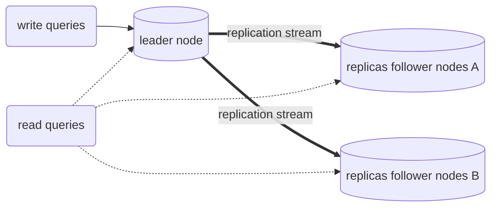

# Replication

## Why we need replication

In the name of

- **scalability** (too much data to fit in one machine)

- **high availablity** (redundancy is good! 😂so you can rest assured even a datacenter is burned down, you data has replicates somewhere else)
- **low latency** (geolocation wise, you need to put data in different zones around the world to serve users faster, physical distance always rules 🥶)

we need distributed data. And we need them in at least 2 ways: **replication** & **partition(sharding)**.

# Replication how to 
The main difficulty of replication is handling *changes* to replicated data. We have 3 ways to handle this: **single-leader**, **multi-leader** & **leaderless**.

## Single Leader

### Data flows

- writes are only accepted by **leader node**
- reads can read from leader or follower

This mode is build-in for many relational dbs such as *Postgres*, *MySql* or *Oracle*, and also for nonrelational dbs as *MongoDB*, *RethinkDB*, *Espresso*. *Kafka* & *RabbitMQ* as message brokers also support the single leader mode.

### Synchronous and asynchronous
When you use **single leader** mode, we decide between sync & async replications:
- *Semi-synchronous*: you can make *one* follower with synchronous replication, and other nodes asynchronous. That means you make sure the data is available at least on leader & *one* follower, and other nodes can use asynchronous replication.
- complete asynchronous: it's common to make the replica completely async, then you can continue process write even *all* the replication failed, but this also causes weak durability (leader一挂就有可能全部挂掉了). 

### Add new follower node
1. constantly take *snapshot* of the leader node's database
2. when add a new follower node, just copy the most recent snapshot to the new node
3. as the snapshot has associative information about the *exact position* in the leader's replication log, the follower can then connect with leader to get all the changes from **that** position
4. once follower has processed all the changes, we say it's *caught-up*, it can then continue receive the new changes as normal.

  > Q: 如果在process changes的时候还是有大量的变化写入leader,这些变化要等到follower process完了才能写进去？（即，是leader持续地向follower push changes,还是follower pull the changes ?)

### Handle failures

#### follower nodes: **catch-up recovery**

that is recover from local logs first, then the same process of 3 & 4 as adding new follower nodes

#### leader node: **failover recovery**

  1. Make sure the leader node *does* fail: like no response for 30 secs except maintenance downtime

  2. Choose a new leader node: run through an election from the remaining nodes(usually the node with the most recent changes to minimize data loss), or if has a previously elected *controller node*.

  3. Reconfiguer the system: make client writing to the new leader, if the older leader came back, make sure it understand there's a new leader and act as follower (how ??)

#### Problems

A lot of things can go wrong when recovering from leader node failure... 😱

  1. Async replication may cause the new leader not have most recent changes (**data loss**)
  2. if the info of the database is used outside of this distributed system (EX: dbs with redis cache), the lag of changes can cause **inconsistence** between those services
  3. The older leader **cannot recognize new leader**
  4. The **timeout** to decide whether a leader node is died is tricky, cannot be too long nor too short

### Replication log

Log is important and failure is hard, so let's look at how to produce replication log first 😹

#### Statement based log
Just log every write request the leader has executed (a *statement*), and send the log to the followers. 

For a relational db, it means every `INSERT`, `UPDATE` and `DELETE` is forwarded to followers, and every follower just execute the SQL it has received.

##### Disadvantage: 
As you can imagine this won't work for the operations has **side-effect** (input depending on other conditions of local db, or need to be sequential).

#### Write-ahead log (WAL) shipping
The way [LSM-Trees](01-data-system-basic.md#sstables-&-lsm-trees) or [B-trees](01-data-system-basic.md#b-trees) are used in databases, they'll always keep an append only log on the disk to recover from crash.

So the leader can send this log along to the followers, then the followers can process this log to build exactly the same data structure as the leader.

##### Disadvantage:
As the log is really low level description ( how every byte is stored at disk block ), and coupled tightly with the database's storage engine, if you want to change or migrate your db format (scheme), it'll be painful:
- either you use a replication protocol that allows the follower has newer version, then use one of the followers with newer scheme to be the new leader
- Or you have to migrate it yourself and has downtime of service

#### Logical (row-based) log replication

We are smart humans so we say, why can't we seperate the replication log from storage log ? 😈 Then the replication log is not tied with a specific database implementation, and it can be more general. They invent a new name for this kind of log: **logical log**.

For **relational databases**, 很多时候就是记录一系列对于数据库的写操作：
- Insert一行，就记录那一行所有的columns的值
- Update一行，需要有一个unique identifier来标记被修改的那一行，然后关于该行所有columns的值（或者至少被修改的columns的值）
- Delete一行，同样需要一个unique identifier来标记被删除的那一行，一般会用primary key，如果没有，则需要记下该行所有的columns的值

如果一个transaction包含了对多个rows的操作，则对每个row都需要生成一条记录(log)，同时还要标记该transaction已经被committed. (MySql的 *binlog* 就是用这一策略).

##### Advantages
- 因为logical log跟数据库的具体实现没有关系，所以leader和followers甚至可以使用不同的数据库（或者至少可以使用数据库的不同版本）。
- Logical log的格式也更容易被外部别的applications读取。例如放到一个data warehouse以进行offline分析，或者可以建立custom indexes and caches. 普遍被称为**change data capture**.

#### Trigger-based replication
上面提到的所有log都是从数据库层面出发的，如果需要更多的flexibility, 比如你只想复制数据的一个subset,或者从一种数据库复制到另一种，我们也可以把replication的逻辑放到application层面。

EXs:
- Oracle GoldenGate可以读取数据库的log，然后让application可以读取data changes.
- Tiggers & stored procedures: 有点类似hook,你可以在application code里写一些custom的code,一旦数据库有data change,这些code就可以把changes写到另外一些分开的表格，以供其他用途。例如Databus for Oracle/ Bucardo for Postgres

通常这种replication会有更多的overheads,也更容易出错，比起数据库内建的replication,好处是如果你真的需要更多flexibility的时候。

### Problems with single leader

For **Hight availability, scalaibility & low latency**, we need replication. 

For **single leader** mode: 

- It would be very useful if the app consist of mostly *reads* and a small percentage of *writes*, then for scaling, you can simply add new follower nodes.
- And it **only** makes sense when you use *asynchronous* replication. (否则任何一个node fail就会导致整个系统不可写)。但此时因为replicate是异步的，可能会导致从follower nodes里读取到的信息没有包含刚写入leader node的信息。It leads to inconsistency in the databases: if you run the same read query from leader node & follower nodes, you may get different values.

第二点中的leader follower不一致一般被称为*eventual consistency*, 因为只要leader有一段时间没有写入新的数据，最终followers总会达到跟leader一致的状态。我们把leader跟followers不一致的这段时间称为*replication lag*.

#### Examples of replication lag

##### Read-after-write-consistency

User want to read what he/she just writes (an update of comments, profile, etc). 

*<u>Possible solutions</u>*: 

- always read sth can be modified by user from leader, and other data from followers
- If most of the data is editable by user, the above solution will cause almost all reads from leader, which defeats the purpose of having multiple followers & not scalable. We can define rules like, check the last_updated time, if it's less than 1 min, then read from leader, otherwise read from followers
- If the followers cannot catch up in the defined timespan, then it won't work. We can also remember the timestamp of most recent write from the client, and the system need to ensure that any read query to a replica 

